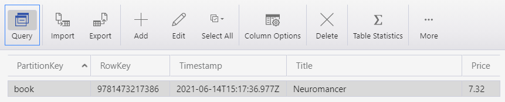
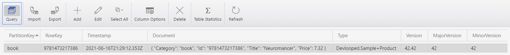

 TableStorage
============

[](https://www.nuget.org/packages/Devlooped.TableStorage)
[](https://www.nuget.org/packages/Devlooped.TableStorage)
[](https://github.com/devlooped/TableStorage/blob/main/LICENSE)
[](https://github.com/devlooped/TableStorage/actions)

Repository pattern with POCO object support for storing to Azure/CosmosDB Table Storage

## Usage

Given an entity like:

```csharp
class Product 
{
  public Product(string category, string id) 
  {
    Category = category;
    Id = id;
  }

  public string Category { get; }  

  public string Id { get; }

  public string? Title { get; set; }

  public double Price { get; set; }
}
```

> NOTE: entity can have custom constructor, key properties can be read-only, 
> and it doesn't need to inherit from anything, implement any interfaces or use 
> any custom attributes (unless you want to).

The entity can be stored and retrieved with:

```csharp
var account = CloudStorageAccount.DevelopmentStorageAccount; // or production one
// We lay out the parameter names for clarity only.
var repo = TableRepository.Create<Product>(storageAccount, 
    tableName: "Products",
    partitionKey: p => p.Category, 
    rowKey: p => p.Id);

var product = new Product("catId-asdf", "1234") 
{
  Title = "Table Storage is Cool",
  Price = 25.5,
};

// Insert or Update behavior (aka "upsert")
await repo.PutAsync(product);

// Enumerate all products in category "catId-asdf"
await foreach (var p in repo.EnumerateAsync("catId-asdf"))
   Console.WriteLine(p.Price);

// Get previously saved product.
Product saved = await repo.GetAsync("catId-asdf", "1234");

// Delete product
await repo.DeleteAsync("catId-asdf", "1234");

// Can also delete passing entity
await repo.DeleteAsync(saved);
```

If a unique identifier among all entities exists already, you can also store all 
entities in a single table, using a fixed partition key matching the entity type name, for 
example. In such a case, instead of a `TableRepository`, you can use a `TablePartition`:

```csharp
class Region 
{
  public Region(string code, string name) 
    => (Code, Name)
    = (code, name);

  public string Code { get; }

  public string Name { get; }
}
```

```csharp
var account = CloudStorageAccount.DevelopmentStorageAccount; // or production one
// We lay out the parameter names for clarity only.
// also be provided to the factory method to override the default behavior.
var repo = TablePartition.Create<Region>(storageAccount, 
  // tableName defaults to "Entities" if not provided
  tableName: "Reference",
  // partitionKey would default to "Region" too if not provided
  partitionKey: "Region",
  rowKey: region => region.Code);

var region = new Region("uk", "United Kingdom"); 

// Insert or Update behavior (aka "upsert")
await repo.PutAsync(region);

// Enumerate all regions within the partition
await foreach (var r in repo.EnumerateAsync())
   Console.WriteLine(r.Name);

// Get previously saved region.
Region saved = await repo.GetAsync("uk");

// Delete region
await repo.DeleteAsync("uk");

// Can also delete passing entity
await repo.DeleteAsync(saved);
```

This is quite convenient for handling reference data, for example. Enumerating all entries 
in the partition wouldn't be something you'd typically do for your "real" data, but for 
reference data, it could be useful.

Stored entities will use individual columns for properties, which makes it easy to browse 
the data. If you don't need the individual columns, and would like a document-like storage 
mechanism instead, you can use the `DocumentRepository.Create` and `DocumentPartition.Create` 
factory methods instead. The API is otherwise the same, but you can see the effect of using 
one or the other in the following screenshots of the [Storage Explorer](https://azure.microsoft.com/en-us/features/storage-explorer/) 
for the same `Product` entity shown in the first example above:





The code that persisted both entities is:

```csharp
var repo = TableRepository.Create<Product>(
    CloudStorageAccount.DevelopmentStorageAccount,
    tableName: "Products",
    partitionKey: p => p.Category,
    rowKey: p => p.Id);

await repo.PutAsync(new Product("book", "9781473217386")
{
    Title = "Neuromancer",
    Price = 7.32
});

var docs = DocumentRepository.Create<Product>(
    CloudStorageAccount.DevelopmentStorageAccount,
    tableName: "Documents",
    partitionKey: p => p.Category,
    rowKey: p => p.Id);

await docs.PutAsync(new Product("book", "9781473217386")
{
    Title = "Neuromancer",
    Price = 7.32
});
```

The `DocumentType` is the `Type.FullName` of the entity type, and the `DocumentVersion` is 
the `Major.Minor` of its assembly, which could be used for advanced data migration scenarios.

In addition to the default built-in JSON plain-text based serializer, you can choose from 
various binary serializers which will instead persist the document as a byte array:

[](https://www.nuget.org/packages/Devlooped.TableStorage)
[](https://www.nuget.org/packages/Devlooped.TableStorage)
[](https://www.nuget.org/packages/Devlooped.TableStorage)

You can pass the serializer to use to the factory method as follows: 

```csharp
var repo = TableRepository.Create<Product>(...,
    serializer: [BsonDocumentSerializer|MessagePackDocumentSerializer|ProtobufDocumentSerializer].Default);
```

> NOTE: when using alternative serializers, entities will need to be annotated with whatever 
> attributes are required by the underlying libraries.

### Attributes

If you want to avoid using strings with the factory methods, you can also annotate the 
entity type to modify the default values used:

* `[Table("tableName")]`: class-level attribute to change the default when no value is provided
* `[PartitionKey]`: annotates the property that should be used as the partition key
* `[RowKey]`: annotates the property that should be used as the row key.

Values passed to the factory methods override declarative attributes.

### TableEntity Support

Since these repository APIs are quite a bit more intuitive than working directly against a  
`TableClient`, you might want to retrieve/enumerate entities just by their built-in `ITableEntity` 
properties, like `PartitionKey`, `RowKey`, `Timestamp` and `ETag`. For this scenario, we 
also support creating `ITableRepository<TableEntity>` and `ITablePartition<TableEntity>` 
by using the factory methods `TableRepository.Create(...)` and `TablePartition.Create(...)` 
without a (generic) entity type argument.

For example, given you know all `Region` entities saved in the example above, use the region `Code` 
as the `RowKey`, you could simply enumerate all regions without using the `Region` type at all:

```csharp
var account = CloudStorageAccount.DevelopmentStorageAccount; // or production one
var repo = TablePartition.Create(storageAccount, 
  tableName: "Reference",
  partitionKey: "Region");

// Enumerate all regions within the partition as plain TableEntities
await foreach (TableEntity region in repo.EnumerateAsync())
   Console.WriteLine(region.RowKey);
```


## Installation

```
> Install-Package Devlooped.TableStorage
```

There is also a source-only version, if you want to avoid an additional assembly dependency:

```
> Install-Package Devlooped.TableStorage.Source
```

The source-only package includes all types with the default visibility (internal), so you can decide 
what types to make public by declaring a partial class with the desired visibility. To make them all 
public, for example, you can include the same [Visibility.cs](https://github.com/devlooped/TableStorage/blob/main/src/TableStorage/Visibility.cs) 
that the compiled version uses, like:

```csharp
namespace Devlooped
{
    public partial interface ITableRepository<T> { }
    public partial interface ITablePartition<T> { }
    public partial class TableRepository { }
    public partial class TableRepository<T> { }
    public partial class AttributedTableRepository<T> { }
    public partial class DocumentRepository { }
    public partial class DocumentRepository<T> { }
    public partial class AttributedDocumentRepository<T> { }
    public partial interface IDocumentSerializer { }
    public partial interface IBinaryDocumentSerializer { }
    public partial interface IStringDocumentSerializer { }
    public partial class TablePartition { }
    public partial class TablePartition<T> { }
    public partial class DocumentPartition { }

    // Perhaps make the attributes visible too if you use them?
    public partial class TableAttribute { }
    public partial class PartitionKeyAttribute { }
    public partial class RowKeyAttribute { }
    public partial class TableStorageAttribute { }
}
```


## Dogfooding

[](https://pkg.kzu.io/index.json)
[](https://github.com/devlooped/TableStorage/actions)

We also produce CI packages from branches and pull requests so you can dogfood builds as quickly as they are produced. 

The CI feed is `https://pkg.kzu.io/index.json`. 

The versioning scheme for packages is:

- PR builds: *42.42.42-pr*`[NUMBER]`
- Branch builds: *42.42.42-*`[BRANCH]`.`[COMMITS]`


## Sponsors

<h3 style="vertical-align: text-top" id="by-clarius">
&nbsp;&nbsp;by&nbsp;<a href="https://github.com/clarius">@clarius</a>&nbsp;
</h3>

*[get mentioned here too](https://github.com/sponsors/devlooped)!*